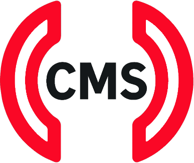
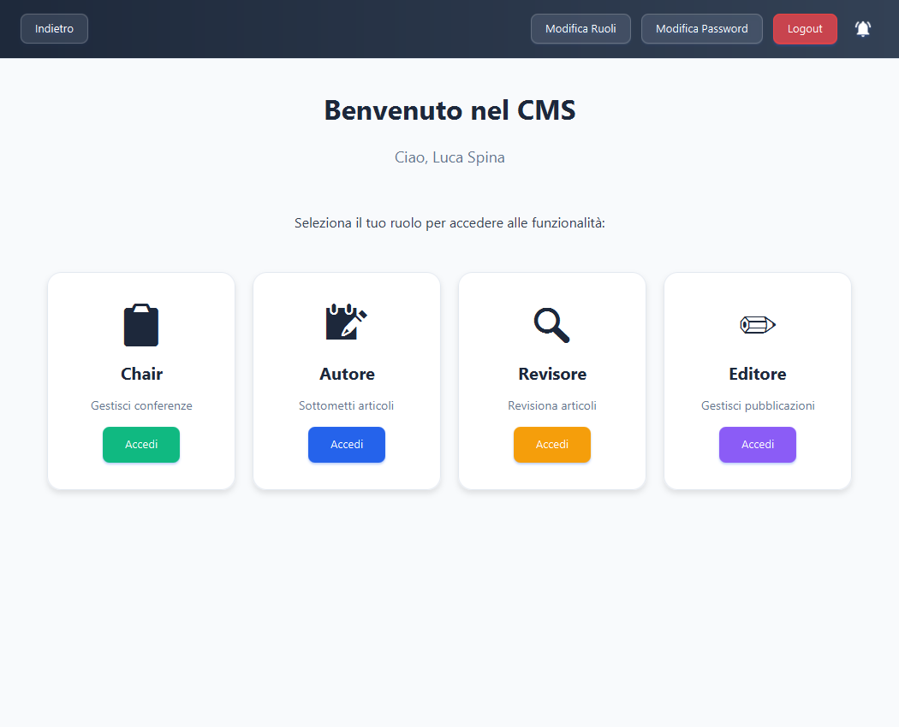
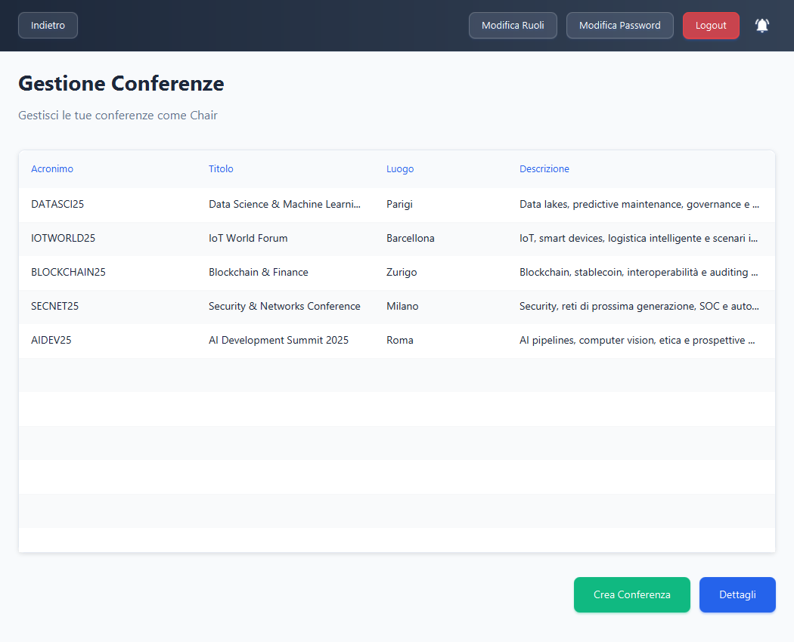
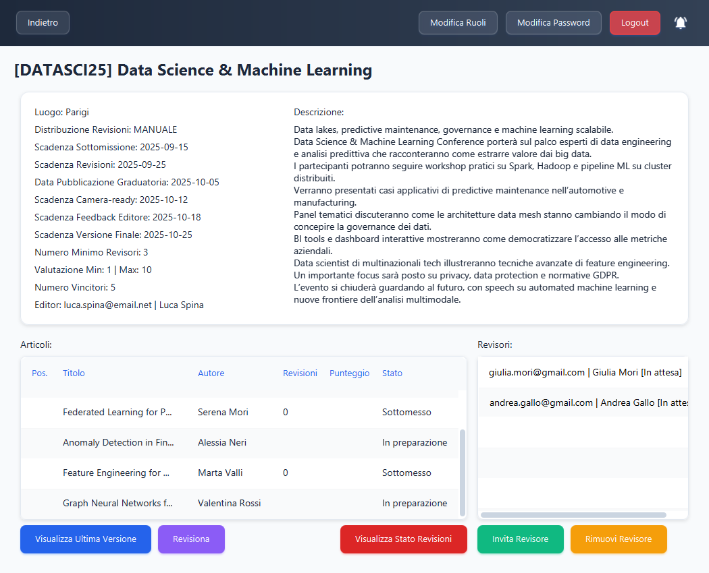
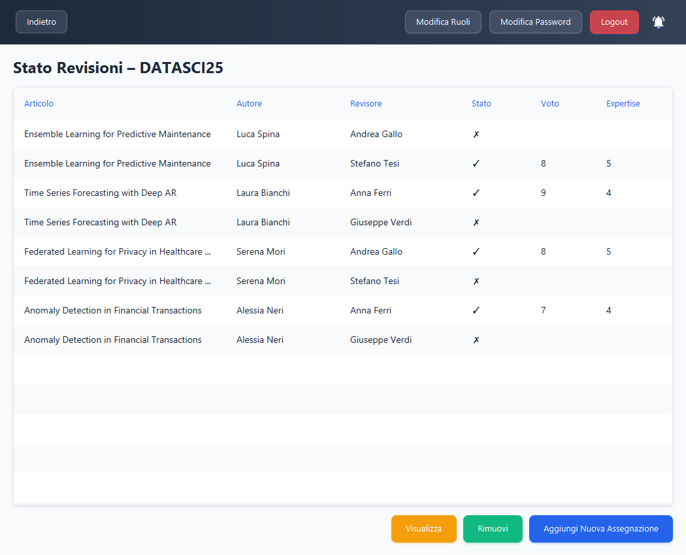
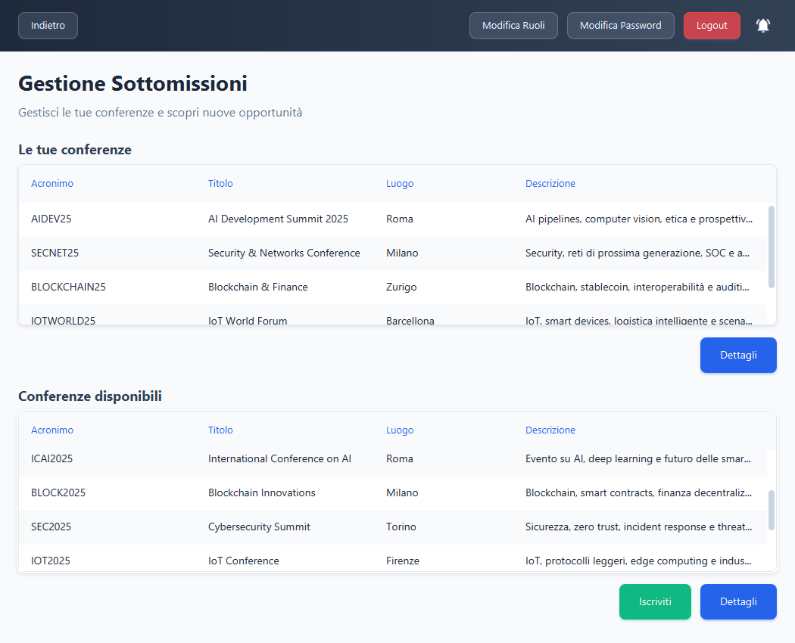
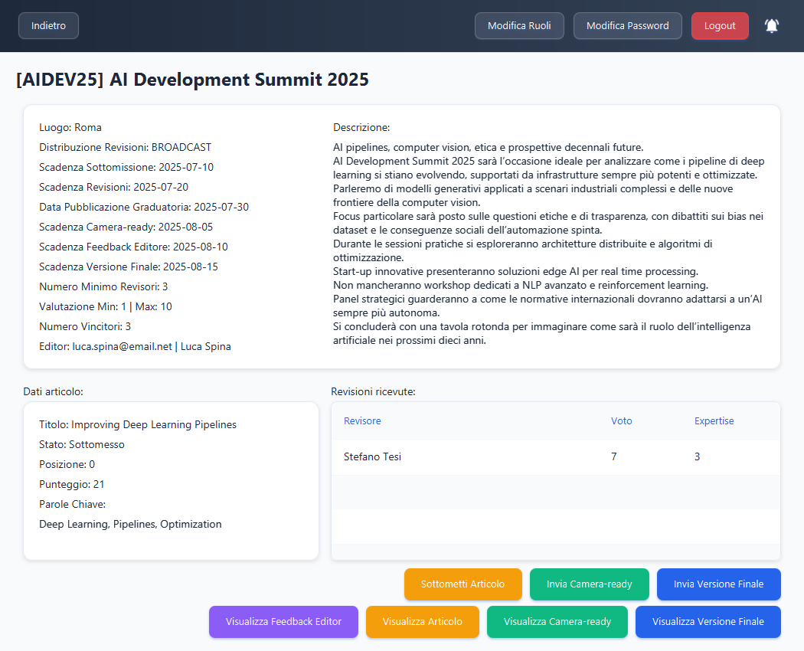
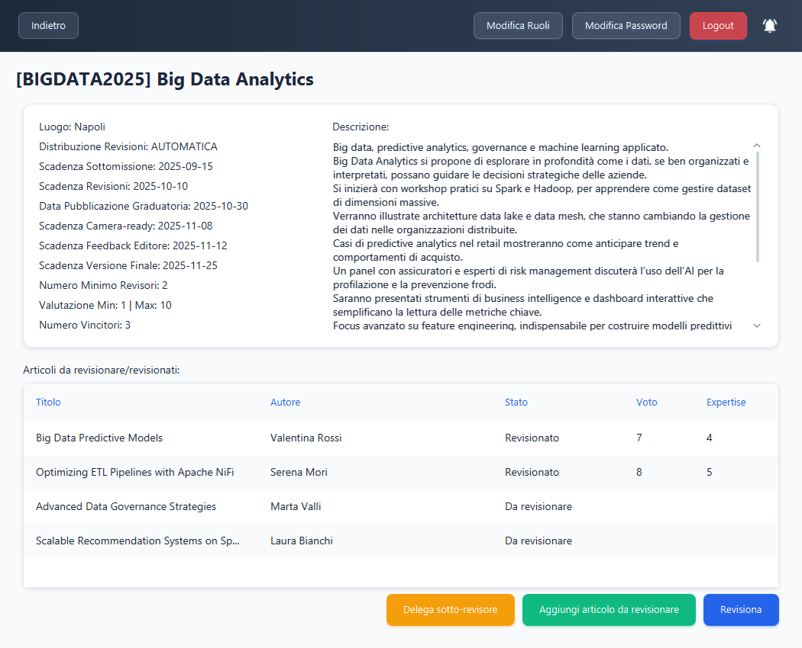
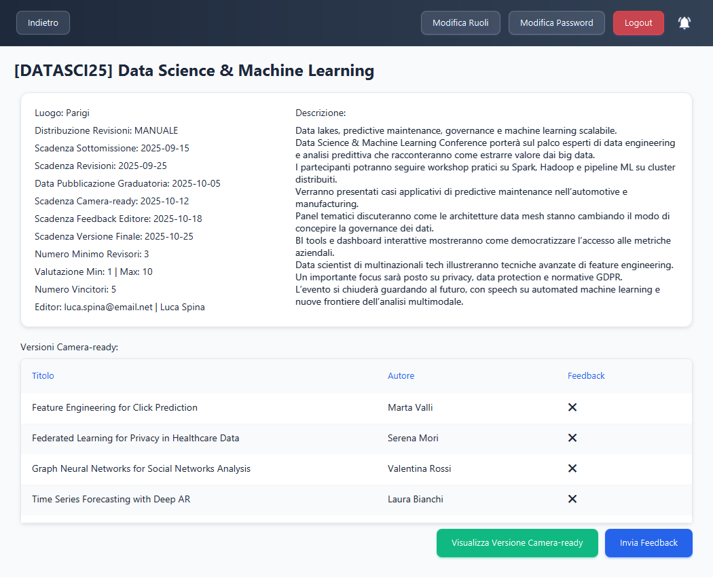
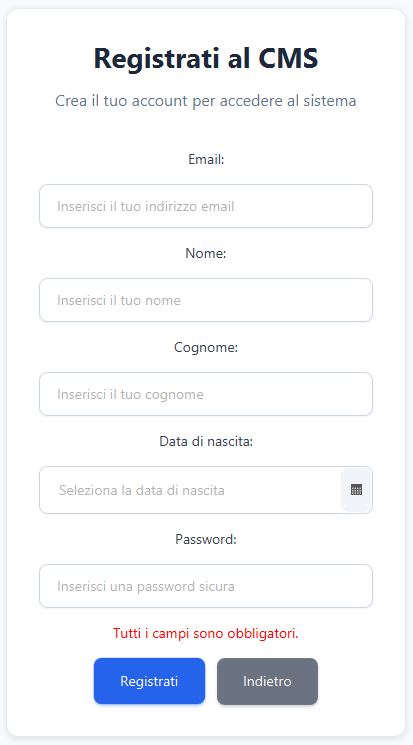

# Conference Management System (CMS)  

  

_Latest release is 1.0. This file last updated on 07 September 2025._
_The software has been developed in Italian language for educational purposes._

## Brief Description ##  

**Conference Management System (CMS)** is a modern JavaFX application designed to manage the entire lifecycle of an academic conference.  
The software supports the different roles involved — **Chair, Authors, Reviewers, and Editors** — providing intuitive tools for handling paper submissions, peer reviews, and the publication of final proceedings.  

Core features include:  
- **Authors** can register, submit papers, view reviews, and upload final versions.  
- **Reviewers** receive assigned papers, evaluate them, and upload review reports.  
- **The Chair** can create and manage a conference, monitor deadlines, and control paper assignments.  
- **Editors** collect accepted final versions and prepare proceedings for publication.  

The CMS implements a **role-based authentication system**, with dedicated interfaces for each user type. It automates crucial processes such as article assignment, deadline management, and communication between participants. Thanks to its clear and consistent graphical interface, users can easily navigate between functions and receive immediate feedback from the system.  

The CMS is intended both as a **practical tool** for small/medium-sized conferences and as an **educational platform** for studying workflow management in the academic environment.  

## Screenshots ##  

### Homepage  
  

### Chair – Homepage  
  

### Chair – Conference Management  
  

### Chair - Reviews Status Overview  
  

### Author – Homepage  
  

### Author – Conference View  
  

### Reviewer – Conference View  
  

### Editor – Conference View  

### User Signup  
  

## License ##  

GNU General Public License, version 2 or later.  
